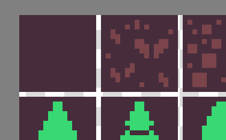
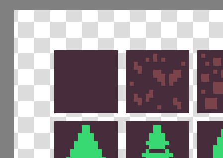
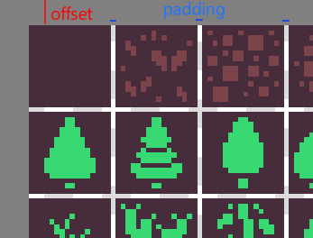

# What is it?

A sprite sheet tool to change padding / offsets

Example from https://kenney.nl/assets/1-bit-pack

## Before



## After



# Building

Install rust, then compile

```
cargo b --release
```

# Usage

```
re-tile <src> <tile_size> <src_padding> <src_offset> <dst> <dst_padding> <dst_offset>

re-tile kenney_1-bit-pack/colored.png 16 0 1 new.png 2 10
```

